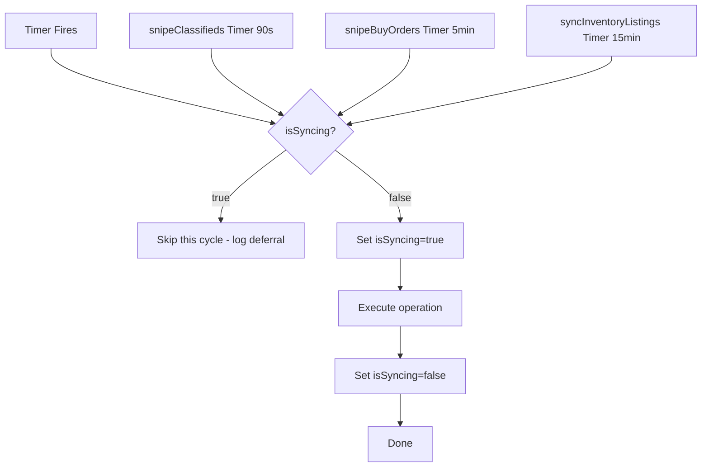
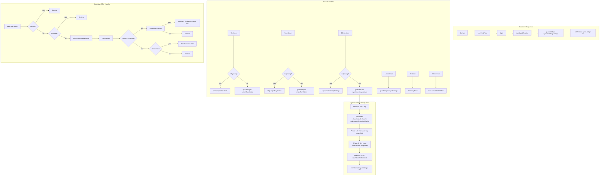

# TF2 Trading Bot — Concurrency & Rate-Limit Architecture Plan

## Overview

This plan addresses four concurrency/rate-limit issues identified in the current [`server.js`](../tf2-trading-hub/server.js) codebase (v1.7.0). Each issue has a corresponding fix with implementation-ready pseudocode.

---

## Issue 1: Missing Concurrency Guard (Mutex) Between Timers

### Problem

The bot uses `setInterval` to run several operations on independent schedules:

| Interval | Operation | File line |
|----------|-----------|-----------|
| 90s | [`snipeClassifieds()`](../tf2-trading-hub/server.js:1666) | line 2092 |
| 5min | [`snipeBuyOrders()`](../tf2-trading-hub/server.js:1957) | line 2093 |
| 15min | [`syncInventoryListings()`](../tf2-trading-hub/server.js:1256) | line 2091 |
| 15min | [`syncListings()`](../tf2-trading-hub/server.js:1223) | line 2089 |

All four share the same Backpack.tf API quota. If [`syncInventoryListings()`](../tf2-trading-hub/server.js:1256) runs long (~40-60s), it can overlap with [`snipeClassifieds()`](../tf2-trading-hub/server.js:1666) or [`snipeBuyOrders()`](../tf2-trading-hub/server.js:1957), causing HTTP 429 rate limits on both.

Additionally, [`syncInventoryListings()`](../tf2-trading-hub/server.js:1256) fires at startup (line 749 inside `webSession` callback) AND the 15-min interval starts immediately. The startup call plus the first interval call can collide.

### Solution: Global Mutex with Sniping Backoff

Introduce a simple boolean mutex (`isSyncing`) that sniping operations check before starting. If a full sync is in progress, snipers skip their cycle.



### Implementation

```javascript
// ─── Concurrency Guard ──────────────────────────────────────────────────────
let isSyncing = false;

async function guardedSync(fn, name) {
  if (isSyncing) {
    console.log(`[tf2-hub] ${name}: skipped — sync in progress`);
    return;
  }
  isSyncing = true;
  try {
    await fn();
  } finally {
    isSyncing = false;
  }
}
```

**Changes required in [`server.js`](../tf2-trading-hub/server.js):**

1. Add `let isSyncing = false;` at module scope (around line 170 with other state)
2. Wrap `syncInventoryListings` calls:
   - Line 749: `syncInventoryListings()` → `guardedSync(syncInventoryListings, 'init-listings')`
   - Line 2091: `syncInventoryListings` → `() => guardedSync(syncInventoryListings, 'auto-bump')`
   - Line 1835: `/api/bump` handler → wrap in guardedSync
   - Line 1625: `sentOfferChanged` → wrap in guardedSync
   - Line 1105: `offer.accept` callback → wrap in guardedSync
3. Wrap `snipeClassifieds` at line 2092: `() => guardedSync(snipeClassifieds, 'snipe-classifieds')`
4. Wrap `snipeBuyOrders` at line 2093-2094: `() => guardedSync(snipeBuyOrders, 'snipe-buy-orders')`

---

## Issue 2: MARKET_SNAPSHOT_TTL Too Short (10min vs 15min Sync)

### Problem

The market snapshot cache TTL is 10 minutes:

```javascript
// line 443
const MARKET_SNAPSHOT_TTL = 10 * 60 * 1000;
```

But [`syncInventoryListings()`](../tf2-trading-hub/server.js:1256) runs every 15 minutes. This means every **second and subsequent run** finds the cache expired (10min < 15min), forcing 58 items × 2 API calls = 116 fresh fetches every cycle.

### Solution: Extend TTL to 15 Minutes

```javascript
// line 443 — change from 10min to 15min
const MARKET_SNAPSHOT_TTL = 15 * 60 * 1000;
```

This guarantees the cache is still hot when the next sync cycle fires.

---

## Issue 3: Startup `syncListings` Double-Fire

### Problem

At startup (line 2083):

```javascript
fetchKeyPrice().then(syncListings).catch(() => {});
```

Then inside [`webSession`](../tf2-trading-hub/server.js:736) callback (line 749):

```javascript
syncInventoryListings().catch(e => ...);
```

And inside [`syncInventoryListings()`](../tf2-trading-hub/server.js:1256) (line 1594):

```javascript
setTimeout(() => syncListings().catch(() => {}), 15000);
```

So the sequence on startup is:
1. `fetchKeyPrice()` → `syncListings()` (immediate)
2. Login completes → `webSession` → `syncInventoryListings()` (immediate)
3. `syncInventoryListings` finishes → `setTimeout(syncListings, 15000)` (15s later)

This means `syncListings()` fires twice within ~15 seconds of startup — a waste of API quota.

### Solution: Defer the Initial `syncListings` Until After Post-Sync

Remove the startup `syncListings()` call at line 2083. The 15s delayed call from `syncInventoryListings` (line 1594) is sufficient.

```javascript
// line 2083 — CHANGE FROM:
fetchKeyPrice().then(syncListings).catch(() => {});
// TO:
fetchKeyPrice().catch(() => {});
```

The `syncListings` will happen naturally 15s after `syncInventoryListings` completes.

---

## Issue 4: No Cache Pre-Warming Before Buy Loop

### Problem

The buy loop at line 1471 iterates over 58 items, calling [`getMarketSnapshot()`](../tf2-trading-hub/server.js:481) for each. On the first run (or after cache expiry), every item incurs a 600ms API penalty (two sequential 300ms fetches). That's ~35 seconds of API calls.

The sell loop (lines 1293-1396) also calls [`getCheapestSellRef()`](../tf2-trading-hub/server.js:1167) and [`getRefPrice()`](../tf2-trading-hub/server.js:350) per item, which already populates the classifieds caches. However, the sell loop and buy loop share the same caches, so the sell loop *does* warm some entries — but the buy loop items may differ from sell loop items.

### Solution: Pre-Warm the Market Snapshot Cache

Before entering the buy loop, batch-pre-warm snapshots for all buy items. This doesn't reduce total API calls (still need 600ms per item), but it makes the timing predictable and logs progress clearly.

```javascript
// Before the buy loop (around line 1470), add:
console.log(`[tf2-hub] pre-warming market snapshots for ${buyItemsParsed.length} buy items...`);
for (const { name } of buyItemsParsed) {
  // This populates both classifiedsSellCache, classifiedsBuyCache, and marketSnapshotCache
  await getMarketSnapshot(name, apiToken);
}
console.log('[tf2-hub] market snapshot pre-warm complete');
```

---

## Complete Architecture Diagram



---

## Files to Modify

| File | Changes |
|------|---------|
| [`server.js`](../tf2-trading-hub/server.js) | Add `isSyncing` mutex, wrap all timer callbacks, extend MARKET_SNAPSHOT_TTL, remove startup syncListings, add cache pre-warming |
| No other files need changes | All fixes are contained in the main server file |

---

## Data Structures: Market Snapshot

```typescript
interface MarketSnapshot {
  truth: number;           // Best estimate of current market sell price (ref)
  buyCeiling: number;      // Maximum we'd ever pay before profit margin
  confidence: 'high' | 'medium' | 'low' | 'untrusted';
  sells: number[];         // Sell-side prices (ascending)
  buyers: number;          // Count of distinct competing buyers
  cheapestSell: number | null;
  median: number | null;
  highestBuy: number | null;
  bpSell: number | null;   // backpack.tf IGetPrices sell price
  outlier: boolean;        // cheapestSell < highestBuy anomaly
}
```

## Concurrency State

```typescript
interface ConcurrencyState {
  isSyncing: boolean;      // Global mutex for Backpack.tf API operations
}
```

---

## Summary of ALL Changes

| # | Change | Location | Impact |
|---|--------|----------|--------|
| 1 | Add `let isSyncing = false` | Module scope, ~line 170 | New state variable |
| 2 | Add `guardedSync()` wrapper function | After appState, ~line 180 | New helper |
| 3 | Wrap startup `syncInventoryListings` | Line 749 | Prevents overlap |
| 4 | Wrap timer `syncInventoryListings` | Line 2091 | Prevents overlap |
| 5 | Wrap timer `snipeClassifieds` | Line 2092 | Skips if syncing |
| 6 | Wrap timer `snipeBuyOrders` | Line 2093-2094 | Skips if syncing |
| 7 | Wrap offer-accept re-sync | Lines 1105, 1625 | Guards post-accept sync |
| 8 | Extend `MARKET_SNAPSHOT_TTL` to 15min | Line 443 | Cache stays hot between cycles |
| 9 | Remove startup `syncListings()` call | Line 2083 | Eliminates double-fire |
| 10 | Add cache pre-warming before buy loop | ~line 1470 | Predictable timing, progress logging |
